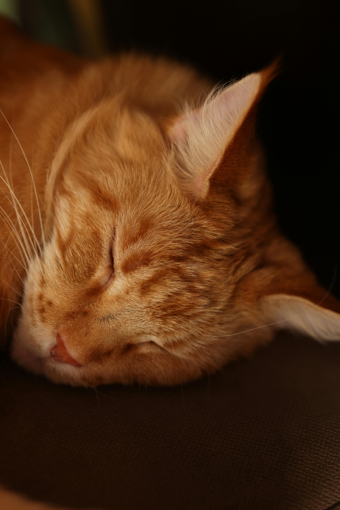
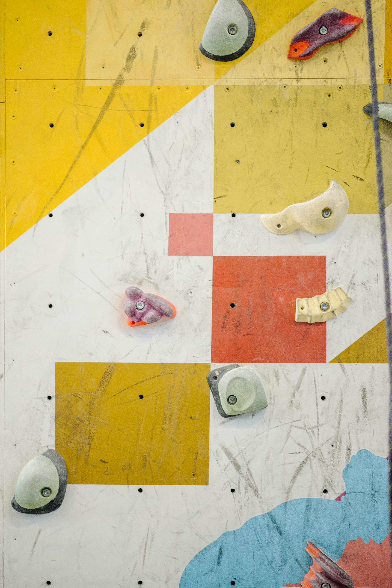
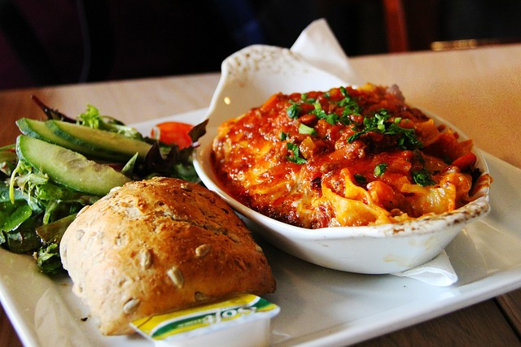
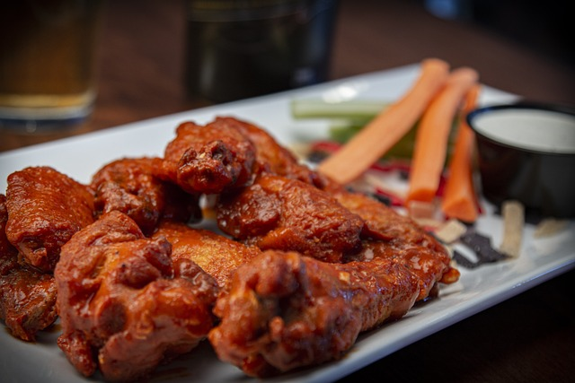
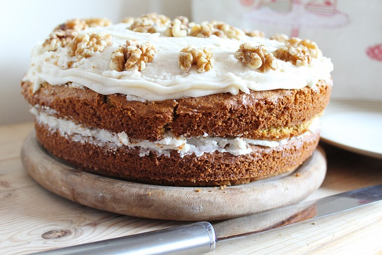

## This is a testing meow meow second part to confirm the merges of the meow meow git.

# HW1
This is repository for homework 1.

## Dixie Laput

Born in Philippines. 

Interests: Coffee, Cats and Dogs, Wall Climbing.

  
   
  

Favourite Food:Lasagna, Chicken Wings, Carrot Cake.

  
   
  

